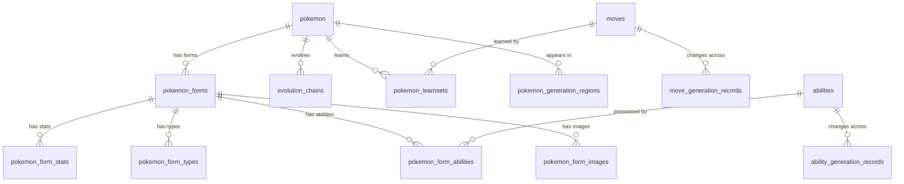

# 数据库设计

## 概述

Pokemon LocalDex 使用单个 SQLite 数据库文件 `data/sqlite/localdex.sqlite` 存储所有结构化数据。数据库由 Python 爬虫创建和写入，由 Node.js API 层只读查询。

所有主表的主键使用 `INTEGER PRIMARY KEY AUTOINCREMENT`，外键关系使用自增整数 ID。API 查询兼容数字 ID、`slug` 和中文名多种方式。

## 表结构总览

数据库包含 14 张表，按功能可分为四组：主实体表、形态相关表、世代记录表和关联表。

### 主实体表

**pokemon** — 宝可梦主表，每只宝可梦一条记录。

| 字段 | 类型 | 说明 |
|------|------|------|
| id | INTEGER PK | 自增主键 |
| dex_number | INTEGER | 全国图鉴编号 |
| slug | TEXT UNIQUE | URL 友好标识 |
| name_zh | TEXT | 中文名 |
| name_ja | TEXT | 日文名 |
| name_en | TEXT | 英文名 |
| category | TEXT | 分类（如"种子宝可梦"） |
| height_m | REAL | 身高（米） |
| weight_kg | REAL | 体重（千克） |
| introduced_generation | INTEGER | 初登场世代 |
| source_url | TEXT | 数据来源页面 URL |
| source_title | TEXT | 来源页面标题 |
| source_fetched_at | TEXT | 抓取时间 |

索引：`dex_number`、`name_zh`、`slug`。

**moves** — 招式表。

| 字段 | 类型 | 说明 |
|------|------|------|
| id | INTEGER PK | 自增主键 |
| number | INTEGER | 招式编号 |
| name_zh | TEXT | 中文名 |
| name_ja | TEXT | 日文名 |
| name_en | TEXT | 英文名 |
| type_name | TEXT | 属性名称 |
| category | TEXT | 分类（物理/特殊/变化） |
| power | INTEGER | 威力 |
| accuracy | INTEGER | 命中率 |
| pp | INTEGER | PP 值 |
| description | TEXT | 效果描述 |
| effect_detail | TEXT | 详细效果说明 |
| introduced_generation | INTEGER | 初登场世代 |

唯一约束：`(number, name_zh)`。索引：`number`、`name_zh`、`type_name`。

**abilities** — 特性表。

| 字段 | 类型 | 说明 |
|------|------|------|
| id | INTEGER PK | 自增主键 |
| number | INTEGER | 特性编号 |
| name_zh | TEXT | 中文名 |
| name_ja | TEXT | 日文名 |
| name_en | TEXT | 英文名 |
| description | TEXT | 效果描述 |
| effect_detail | TEXT | 详细效果说明 |
| introduced_generation | INTEGER | 初登场世代 |

唯一约束：`(number, name_zh)`。索引：`number`、`name_zh`。

**items** — 道具表。

| 字段 | 类型 | 说明 |
|------|------|------|
| id | INTEGER PK | 自增主键 |
| legacy_id | TEXT UNIQUE | 旧版标识 |
| slug | TEXT | URL 友好标识 |
| name_zh | TEXT | 中文名 |
| name_ja | TEXT | 日文名 |
| name_en | TEXT | 英文名 |
| category | TEXT | 道具分类 |
| effect_summary | TEXT | 效果摘要 |

索引：`name_zh`、`category`。

### 形态相关表

宝可梦的形态数据采用"一主多从"的设计：`pokemon_forms` 是形态主表，每个形态的属性、种族值、特性和图片分别存储在独立的子表中，通过 `form_id` 关联。

**pokemon_forms** — 形态主表，每只宝可梦至少有一个 `default` 形态。

| 字段 | 类型 | 说明 |
|------|------|------|
| id | INTEGER PK | 自增主键 |
| pokemon_id | INTEGER FK | 关联 pokemon.id |
| form_key | TEXT | 形态标识（如 `default`、`超级进化`） |
| name_zh | TEXT | 形态中文名 |
| form_type | TEXT | 形态类型（default/mega/gmax/regional 等） |
| is_default | INTEGER | 是否为默认形态 |
| sort_order | INTEGER | 排序序号 |

唯一约束：`(pokemon_id, form_key)`。

**pokemon_form_stats** — 形态种族值表，支持世代范围。当某个形态的种族值在不同世代有变化时（如皮可西在第六世代特攻从 85 变为 95），会有多条记录，通过 `generation_start` 和 `generation_end` 区分。

| 字段 | 类型 | 说明 |
|------|------|------|
| form_id | INTEGER FK | 关联 pokemon_forms.id |
| generation_start | INTEGER | 生效起始世代（含） |
| generation_end | INTEGER | 生效结束世代（含），NULL 表示至今 |
| hp, atk, def, spa, spd, spe | INTEGER | 六项种族值 |

**pokemon_form_types** — 形态属性表，同样支持世代范围。

| 字段 | 类型 | 说明 |
|------|------|------|
| form_id | INTEGER FK | 关联 pokemon_forms.id |
| type_name | TEXT | 属性名称 |
| slot | INTEGER | 属性槽位（1=第一属性，2=第二属性） |
| generation_start | INTEGER | 生效起始世代 |
| generation_end | INTEGER | 生效结束世代 |

**pokemon_form_abilities** — 形态特性表，支持世代范围。

| 字段 | 类型 | 说明 |
|------|------|------|
| form_id | INTEGER FK | 关联 pokemon_forms.id |
| ability_id | INTEGER FK | 关联 abilities.id |
| ability_name_zh | TEXT | 特性中文名（冗余，便于查询） |
| slot | INTEGER | 特性槽位 |
| is_hidden | INTEGER | 是否为隐藏特性 |
| generation_start | INTEGER | 生效起始世代 |
| generation_end | INTEGER | 生效结束世代 |

**pokemon_form_images** — 形态图片表，每个形态可有多种图片。

| 字段 | 类型 | 说明 |
|------|------|------|
| form_id | INTEGER FK | 关联 pokemon_forms.id |
| image_kind | TEXT | 图片类型（official/shinyOfficial/sprite/shinySprite） |
| url | TEXT | 图片 URL |
| alt | TEXT | 替代文本 |

唯一约束：`(form_id, image_kind)`。

### 世代记录表

**move_generation_records** — 招式世代差异记录，记录招式在不同世代的效果描述变化。

| 字段 | 类型 | 说明 |
|------|------|------|
| move_id | INTEGER FK | 关联 moves.id |
| generation | INTEGER | 世代编号 |
| game_version_code | TEXT | 游戏版本代码 |
| description | TEXT | 该世代的效果描述 |
| notes | TEXT | 备注 |

**ability_generation_records** — 特性世代差异记录。

| 字段 | 类型 | 说明 |
|------|------|------|
| ability_id | INTEGER FK | 关联 abilities.id |
| generation | INTEGER | 世代编号 |
| description | TEXT | 该世代的效果描述 |
| notes | TEXT | 备注 |

### 关联表

**evolution_chains** — 进化链表，记录宝可梦之间的进化关系。

| 字段 | 类型 | 说明 |
|------|------|------|
| chain_id | INTEGER | 进化链编号（同一进化链共享） |
| from_pokemon_id | INTEGER FK | 进化前宝可梦（NULL 表示链起点） |
| to_pokemon_id | INTEGER FK | 进化后宝可梦 |
| from_form_key | TEXT | 进化前形态 |
| to_form_key | TEXT | 进化后形态 |
| stage | INTEGER | 进化阶段（0=基础，1=一阶，2=二阶） |
| evolution_method | TEXT | 进化方式 |
| evolution_condition | TEXT | 进化条件 |
| evolution_item | TEXT | 进化道具 |
| evolution_level | INTEGER | 进化等级 |

**pokemon_learnsets** — 宝可梦可学招式表，按世代和学习方式记录。

| 字段 | 类型 | 说明 |
|------|------|------|
| pokemon_id | INTEGER FK | 关联 pokemon.id |
| form_key | TEXT | 形态标识 |
| move_id | INTEGER FK | 关联 moves.id |
| move_name_zh | TEXT | 招式中文名 |
| generation | INTEGER | 世代编号 |
| game_version_code | TEXT | 游戏版本代码 |
| learn_method | TEXT | 学习方式（level-up/tm/egg/tutor 等） |
| level | INTEGER | 学习等级（仅升级学习） |
| tm_number | TEXT | 招式学习器编号 |

唯一约束：`(pokemon_id, form_key, move_name_zh, generation, game_version_code, learn_method, level)`。

**pokemon_generation_regions** — 宝可梦地区图鉴编号。

| 字段 | 类型 | 说明 |
|------|------|------|
| pokemon_id | INTEGER FK | 关联 pokemon.id |
| generation | INTEGER | 世代编号 |
| region | TEXT | 地区名称 |
| regional_dex_number | TEXT | 地区图鉴编号 |

## ER 关系

## 设计要点

**形态优先**：宝可梦的属性、种族值、特性和图片都挂在形态（`pokemon_forms`）下而非宝可梦主表上。这样可以自然地表达超级进化、地区形态、面具形态等不同形态各自独立的数据。

**世代范围**：形态子表（stats/types/abilities）使用 `generation_start` 和 `generation_end` 表示生效范围，而非为每个世代创建一条记录。这样既节省空间，又能方便地查询"第 N 世代时这个形态的种族值是多少"。

**冗余中文名**：`pokemon_form_abilities.ability_name_zh` 和 `pokemon_learnsets.move_name_zh` 冗余存储了中文名。这是因为爬虫解析时可能还没有对应的 abilities/moves 记录（采集顺序不固定），冗余字段保证数据完整性，同时也简化了查询。
